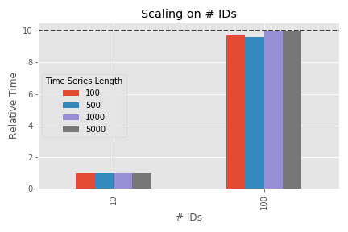
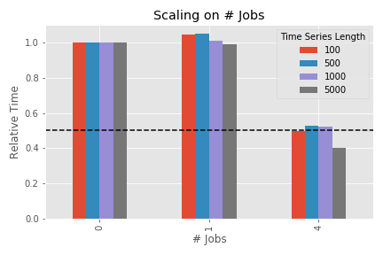
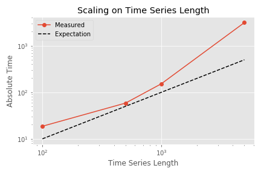
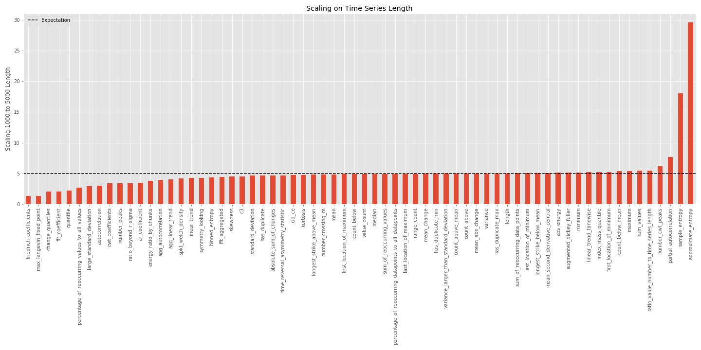
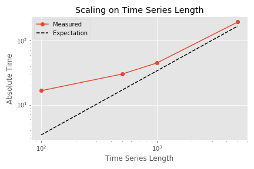

This blog post will describe how to measure the execution times of applying `tsfresh`'s feature extraction on various different time series and discuss the results.

## Introduction

Most computational calculations take time.
How much, depends on various factors: how much IO is involved? How many CPU cycles are needed? How good is the utilization of the cache?
The number one rule when optimizing the speed of a program is: measure the execution time.
There are multiple reasons for this:
1. It is complicated to predict the performance of a computation due to the various background optimizations that happen.
2. Performance optimizations of one part can decrease the performance in other areas (less IO might mean more computations)
3. If you have a concise study of the execution time of your program in various different parameter settings, your users can easily predict their execution time.

Today, this post will focus especially on the last aspect and use `tsfresh` as an example: what is the execution time of the feature extraction depending on the input data?

`tsfresh` is a package to automate the extraction of relevant features of time series. A *time series* is a series of (typically measured) numbers, which show some sort of time dependency (even though the functional form of the dependency is often unknown). Good examples of time series are stock market prices or the measurement of the heart rate of a patient over time.
A *feature* of a time series is a single number, which describes a particular characteristics of a time series.
For example the maximum and minimum value of the measured heart rate over time can be an indication for certain heart diseases.
Using many of these features together, it is for example possible to train machine learning models for classification or predicting future time series values.
More information on `tsfresh` and how it works can be found in our [documentation](https://tsfresh.readthedocs.io/en/latest/).

However, extracting those features takes time - especially as some of them are computationally complicated.
But how much time?
That depends on the amount of data you put in, how many cores you use and which features you extract.
Let's see how this all comes together.

## Measuring the execution time

For this study, we want to extract the execution time of `tsfresh` depending on various input values:
* how many time series?
* how long are the time series?
* which features are extracted?
* how many CPUs are used?

In general, the measurement process can be divided into three parts:
1. create the input data using the given input parameter
2. measure the time
3. collect and summarize the results

As the number of input parameter combinations we want to test is large, we use a workflow management tool for this.
In this case, I used [`luigi`](https://luigi.readthedocs.io/en/stable/).
We will not go into the details of the measurement script, but you can find it [here on github](https://github.com/blue-yonder/tsfresh/blob/85ad39b3e139153cc6ed9bc1c8d4011f26b765f1/tsfresh/scripts/measure_execution_time.py).

For a reproducible and well-defined result, all calculations were done on a `e2-standard-4` google cloud compute instance.
You can easily create the results by yourself, by creating a compute instance, installing the needed packages and cloning the `tsfresh` github repository (but attention, the measurement will take some time!):

    gcloud compute instances create measurement-machine --machine-type e2-standard-4
    COMMAND="
        sudo apt install -y python3-pip git;
        git clone https://github.com/blue-yonder/tsfresh.git;
        cd tsfresh;
        git checkout feature/improved-speed;
        sudo pip3 install -e .;
        cd tsfresh/scripts;
        python3 measure_execution_time.py;
    "
    gcloud compute ssh measurement-machine --command ${COMMAND}

Make sure you have your google cloud account ready and the google cloud SDK installed and [set up correctly](https://cloud.google.com/sdk/docs/quickstarts).
The final results of the measurement will be written into `results/result.csv`.

Now, let's see how they look like!

## tsfresh's Execution Time

Before we come to the absolute numbers, let's first have a look into the scaling behavior depending on various input parameters.
For all shown measurements, I used input data consisting of purely random numbers.
In principle the shape of the input data can also have a large impact on the time spent in feature extraction.
However, it is basically impossible to test out all different input data distributions, so I choose random data as a compromise.

The measurements use `tsfresh` on commit [`85ad39b`](https://github.com/blue-yonder/tsfresh/tree/85ad39b3e139153cc6ed9bc1c8d4011f26b765f1), which will soon be included in the upcoming release `0.16.0`.

### Scaling with number of time series

In `tsfresh` each input time series is treated independently.
This means if you feed in the series of stock market prices of Apple and Facebook, the feature extraction will happen separately on both.
In the nomenclature of `tsfresh`, different time series will have a different identifier (or `id`).
Therefore the expectation should be clear: if you input 10 times more time series, the execution time should be 10 times higher.

[](../assets/images/execution_time/scaling_ids.png){:class="center-image"}

The figure shows the time spent in feature extraction for 10 and 100 input time series for different lengths of the time series data (100, 500, 1000 and 5000) - relative to the execution time of 10 time series.
So the bar at 10 has - by definition - a height of 1 (and is just shown for reference).
The measurement was done on a single CPU only.

As 100 `id`s is 10 times higher than 10, we expect a 10 times higher execution time.
That is the case - except for small time series.
Why?
Because for very small amount of data the overhead of the input and output data preparation `tsfresh` needs to perform (e.g. grouping, sorting, transforming) has a higher impact on the total execution time.
As this overhead is approximately constant, it does not play a large role for large total execution times (which is the case for large amounts of data).
This means, with "reasonable" long input data, the overhead is negligible and more time series means linearly more execution time.
So far - so expected.

The next parameter we can tune is the number of cores we use.
The execution engine we used has 4 logical cores or 2 physical cores respectively (see [here](https://superuser.com/questions/1105654/logical-vs-physical-cpu-performance) for the difference between logical and physical cores).
Therefore we expect to double the performance when moving from single- to multiprocessing.

[](../assets/images/execution_time/scaling_jobs.png){:class="center-image"}

The shown figure is similar to the one before, but this time not the number of time series is changed but the number of CPUs used in the calculation.
"0" means strictly single processing, "1" is multiprocessing on a single core (this means: the overhead of multiprocessing but without expected speedup) and "4" means all (logical) CPUs are used.
Two anomalies can be seen:
* multiprocessing introduces an overhead in the order of a few percent for small amounts of data (e.g. the bar of "1" is higher than the one for "0" for a time series length of 100), which is however completely mitigated once the actual speedup of multiple cores kicks in
* for a large data sample, the performance on all two physical cores is actually better than just doubled. The reason for this is the distinction between physical and logical cores. The details can be quite complicated, but it is in general a consequence of [hyper-threading](https://en.wikipedia.org/wiki/Hyper-threading) or any similar technology.

So in general: doubling the number of physical cores will give you a doubled performance (plus some extra boost due to hyper-threading).

Now comes the last aspect: the size of the individual time series.
One could expect also here: doubling the data means doubling the execution time.
Now quite correct.
Some of the calculated features need to perform operations such as folding the time series with itself, which do not scale linearly with the amount of data points.

[](../assets/images/execution_time/scaling_length.png){:class="center-image"}

This figure shows the total execution time for different time series lengths (with single processing and 100 input time series).
Please note the logarithmic scales on both axes.
The execution time grows faster than expected and clearly faster than the shown linear expectation.
This is due to the non-linear scaling behavior of some of the features, which is described above.

But which features are those?
The next figure compares the execution time for an input length of 1000 and 5000 for each feature separately.
If the feature scaled linearly with the input data, the increase should be a factor of 5, which is shown as dashed line.
Click on the graph for a higher resolution.

[](../assets/images/execution_time/scaling_length_detail.png){:class="center-image"}

It can be seen that most of the features scale linearly.
The two dominant exceptions: the entropy features.
Simplified, these features involve a calculation in the form

```python
for x in time_series:
    for y in time_series:
        f(x, y)
```

which scales quadratically with the number of data points (the details are probably a bit more complicated, but do not really matter here).

But what happened on the lower side of the graph?
There are features which scale better than linear with the time series length?
These features include a large constant term in their processing time, which is independent on the time series length.
For example the `friedrich_coefficients` feature first bins the data according to the quantiles and then performs a polynomial fit on the mean values of these bins.
The execution time of this fit does not depend on the amount of data anymore but only on the number of extracted quantile bins (which is a fixed configuration parameter).
With even larger time series lengths (not shown here), this constant term would be negligible and the feature would also scale linearly with the time series length again.

Now, what happens if we remove the worse-than-linearly-scaling features?
The next figure shows the scaling behavior without these "slow" features.
This setting is called [`EfficientFCParameters`](https://tsfresh.readthedocs.io/en/latest/api/tsfresh.feature_extraction.html#tsfresh.feature_extraction.settings.EfficientFCParameters) and can be tuned using the [feature extraction settings](https://tsfresh.readthedocs.io/en/latest/text/feature_extraction_settings.html).

[](../assets/images/execution_time/scaling_length_eff.png){:class="center-image"}

Due to the shorter total execution time, the small time series execution times are more influenced by the constant overhead terms involved in the calculation.
But for higher lengths, the extraction time is now approximately linearly scaling.

### Absolute times

It is very important to understand the scaling behavior to predict how the execution time will behave with different input data.
But it is also important to know the absolute numbers.
If the absolute execution time is 1s and it is increased by a factor of 10 it might not be so bad.
But if you need to wait 2h instead of 10 minutes, you definitely want to know!

Here are the execution times for all features (or only the ones in `EfficientFCParameters`) for a single time series `ìd` of different lengths and a single CPU, measured on a `e2-standard-4` google cloud VM instance ([specs](https://cloud.google.com/compute/docs/machine-types)):

| Time Series Length | Execution Time (in s) | Only Efficient Features |
|--------------------|-----------------------|-------------------------|
|                100 |                 0.185 |                   0.166 |
|                500 |                 0.584 |                   0.302 |
|               1000 |                 1.518 |                   0.450 |
|               5000 |                31.392 |                   1.965 |


As a rough first guess, you can calculate the expected execution time using this empirical formula:

    t(N, n, p) = n / p * (1.22e-06 * N**2 + 1.4e-04 * N + 1.8e-01)

where `N` is the length of a single time series, `n` is the number of time series and `p` the number of physical cores.

As seen above, the scaling behavior with the efficient features is nearly linear, so it can be estimated with

    t(N, n, p) = n / p * (3.7e-04 * N + 1.1e-01)

Three last comments:
* There is another constant factor (which includes pre-processing and the overhead of multiprocessing) which is not included in this formula.
  However, for any reasonable usage of `tsfresh` (typical amount of data, typical number of cores), this is negligible.
* If execution time is really important to your use case, you should not "blindly" extract all features. Start with a subsample of your data and find out, which features are really important to you. Then extract only those features by tuning the [feature extraction settings](https://tsfresh.readthedocs.io/en/latest/text/feature_extraction_settings.html). At least, use the `EfficientFCParameters`.
* These absolute numbers depend on your computing infrastructure (whereas the scaling behavior will be similar)! Different CPUs, different memory etc. can cause performance boosts or decreases.
  Your mileage may vary.
