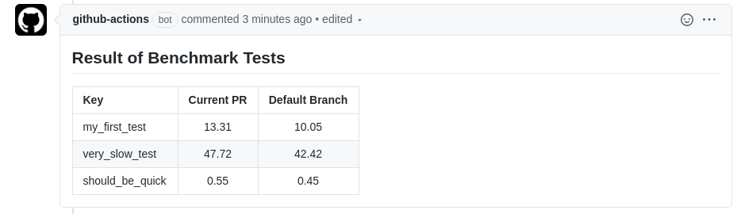

We will build a small GitHub action with TypeScript in this post!

## Introduction

GitHub actions is the new CI/CD tool and it comes with some very nice benefits: simple workflow file syntax, good documentation, very nice integration with GitHub (obviously) and, most importantly, the possibility to write and share single action tasks easily.

There exist a large [marketplace](https://github.com/marketplace?type=actions) of community-written actions, but even if you do not find what you are looking for: it is very easy to [write](https://help.github.com/en/actions) your own.
In this blog post, we will walk through the process of writing, testing and publishing a simple GitHub action written in TypeScript from scratch.
Its task will be to read in two JSON documents (coming from previous tasks), comparing them and commenting on a pull request with a markdown table of this comparison.
I used a similar application for [my](https://github.com/nils-braun/pytest-benchmark-commenter) GitHub action to publish pytest benchmarking results on a pull request.

## Preparation

Github actions let you define one (or multiple) [workflow yaml-files](](https://help.github.com/en/actions/reference/workflow-syntax-for-github-actions) stored in `.github/workflow` in your GitHub repository.
In these files, you can define [when a workflow should run](https://help.github.com/en/actions/reference/events-that-trigger-workflows) (e.g. when a pull request is created, when a release is done, when a push to your default branch happened etc.) and which tasks should be processed.
These tasks are the meat of the workflows and can be controlled via parameters from the workflow file.
They can either be defined as a reference of another GitHub repository containing the task code or a docker image.
Docker images give you a lot more control and liberty, but for very simple tasks (as the one in this example), we can stick with defining the task directly as javascript code in another repository, which we reference.
On most of the cases, you will not write your own action code but rather reference one of the many already created actions.

The action we will write today has two tasks: read in two JSON files given as input parameters and write a combined markdown table with their contents to the pull request that triggered this action.
One of the JSON files will be created from the current CI/CD pipeline (e.g. it could be the benchmark results from your test suite), the other one will come from the current default branch - so you can compare the pull request to your current software (and maybe see performance degradations).
We will assume the JSON file to be in a very simple format

```json
{
    "key1": 1,
    "key2": 2,
}
```

which we want to transform into a table, that looks like this

| Key | This PR | Default Branch |
|-----|---------|----------------|
| key1 | value1a | value1b |
| key2 | value2a | value2b |

So let's start!
First, we create a git repository to host our action code and to reference it later from our workflow files.
Head over to your GitHub account page and create a new repository.
Make sure to name your [default branch](https://www.hanselman.com/blog/EasilyRenameYourGitDefaultBranchFromMasterToMain.aspx) other than "master" (e.g. "main").
Give the repository a reasonable name (such as `github-json-commenter`) and copy the clone URL, which will be shown.
On your own device, clone the URL of your repository and enter the folder you cloned (which is empty so far).

As a first step, we will create workflow files to test our action.
In principle, you could also do this in a separate repository, but with using the same repository we have already a nice integration test.

First, we will create a workflow to benchmark the default branch.
We will fake it by just using a static file for the JSON output.
So, create a file called `benchmark.json` and fill it with some content:

```json
{
    "my_first_test": 10.05,
    "very_slow_test": 42.42,
    "should_be_quick": 0.45
}
```

Later, this file will be created on the fly by one of the tasks in your workflow.

Now, create the workflow file `.github/workflows/benchmark_default.yml`:

```yaml
# Workflow to benchmark the default branch and store the results
# as an artifact.
name: Benchmark the default branch
# run this workflow only on new commits on the default branch
on:
  push:
    branches:
      - "main" # replace with however your default branch is named

# A workflow consists of multiple jobs
jobs:
  benchmark:
    runs-on: ubuntu-latest
    name: Run the benchmarks
    # Which themselves consist of multiple steps
    steps:
        # Each step can have a name and either references another
        # github repository (as in this case) or a docker image (not shown).
        # Please note that all references must have a version tag,
        # which forces you to pin your versions (good!)
        # The first task just clones your repository into the
        # work area of the workflow
      - name: Checkout
        uses: actions/checkout@v2

        # Normally you would produce the benchmark output here

        # In the last task we upload the benchmark results
        # as artifacts. This will allow us to use them in a different
        # workflow later.
      - name: Upload the results
        uses: actions/upload-artifact@v2
        # this is how you pass arguments to the action,
        # in this case the arguments "name" and "path".
        # You can lookup what these arguments do
        # in the task repository:
        # https://github.com/actions/upload-artifact
        with:
          name: benchmark_results
          path: benchmark.json

```

Commit both files and push your first commit to your default branch on GitHub.
You can now go to the "Actions" tab of your repository and see your first workflow run being processed.
After it has successfully completed, you can check the uploaded artifact: it will contain a single JSON file (the one you created earlier).

Next, we create a workflow definition for pull requests, which will also run the benchmarks (or, in our case, just use the file), download the artifact from the default branch and run our comparison-and-comment-action.
So go back to your device, create a new branch called `test-pull-request` and create a new workflow file `.github/workflows/benchmark_pr.yml`:

```yaml
# Workflow to benchmark pull requests and compare with the default branch.
name: Benchmark pull requests and compare
# This time, run on pull requests against your default branch
on:
  pull_request:
    branches:
      - "main" # again, replace if needed

jobs:
  benchmark:
    runs-on: ubuntu-latest
    name: Run the benchmarks and compare
    steps:
      - name: Checkout
        uses: actions/checkout@v2

        # Run your benchmarks here...

        # Good example for a community action:
        # it downloads and extracts artifacts from
        # other workflows and/or other branches
      - name: Download benchmark artifact
        uses: dawidd6/action-download-artifact@v2
        with:
          # The ${ } is the way in github actions to
          # specify variables.
          # See here: https://help.github.com/en/actions/reference/context-and-expression-syntax-for-github-actions
          # github is a predefined variable, which
          # contains a lot of useful information, e.g.
          # a API token specific to your repository
          # to access the GitHub API.
          github_token: ${{ github.token }}
          # A reference to our other workflow file
          workflow: benchmark_default.yml
          # The name of the artifact we created there
          name: benchmark_results
          # Where to put the downloaded artifacts
          path: old_benchmark
          # Again, some information we use from the
          # github variable: get the commit-hash of
          # the target branch of this PR
          # (= the newest commit on our default branch)
          # and use the artifacts from the workflow,
          # that happened on this commit.
          # See here: https://developer.github.com/webhooks/event-payloads/#pull_request
          commit: ${{github.event.pull_request.base.sha}}
        # The benchmark on the default branch could fail for
        # multiple reasons. We still want to go on with
        # this workflow, even if the default branch
        # result is not available.
        continue-on-error: true
      - name: Compare and comment
        # Use the action defined in this repository
        uses: ./
        with:
          # we pass two arguments:
          # where to find the current JSON file
          json_file: "benchmark.json"
          # and where to find the comparison JSON file
          comparison_json_file: "old_benchmark/benchmark.json"

```

Commit and push to your branch (which should not trigger any workflow so far).
Then create a pull request against your default branch.
The newly defined workflow should start running, but will fail, as we have not defined any action in this repository it is referencing in the last step!
So let's to this now.

## Initialize the Action

We will write our pipeline in TypeScript (think of: javascript with types), but GitHub can only handle plain javascript files.
Therefore, we will need to do a bit of translation.
In many javascript applications, this is done via complicated build pipelines (with strange names, such as ["gulp"](https://gulpjs.com/) or ["grunt"](https://gruntjs.com/)), but we will try to keep it simple here and only use what is already built into npm.
[npm](https://www.npmjs.com/) is the package manager of [nodejs](https://nodejs.org/en/), which is a way to run javascript outside of the browser.
If you have never heard of nodejs or npm: no problem, we only need a very small subpart of it.
First however, you need to install nodejs by following the description on the [website](https://nodejs.org/en/) for your operation system.
Installing nodejs will also bring you a new command `npm`, which will call the package manager.

Before `npm` (or nodejs) can do anything, it needs a `package.json` file to describe, what project we have, what its dependencies are etc.
You can create one by going to your project folder and calling

    npm init -y

which will create the default `package.json` file.
Feel free to edit things such as the author, the description or the licence to your own needs.
We will now install multiple dependencies via `npm`.
The cool thing is, that `npm` can automatically store the dependencies into the `package.json` file, so it be perfectly reproducible.

    npm install --save-prod @actions/github @actions/core
    npm install --save-dev @zeit/ncc typescript prettier

The dependencies are now installed into the folder `node_modules` (which you should not add to git).
We will cover later, what these packages actually do.

As you see from the arguments (and if you have a look into `package.json`), `npm` separates between dependencies for development and dependencies for the running app.
The top-level dependencies are now added to `package.json`.
All additional sub-dependencies are also pinned and written to `package-lock.json`.
Everyone with these files running just

    npm install

will get exactly the same environment as you have - so you should make sure to commit those files.

Our goal is to produce a single javascript file, where all dependencies are merged into a single file for GitHub to use.
As we start with a typescript file, there are two steps you need to do:
1. Translate the TypeScript file to plain javascript. This is done by the `typescript` package.
2. Merge all production dependencies and the javascript code into a large javascript file. This is done by the `zeit/ncc` package.
As we do not want to remember how to run these two steps all the time, we define a build alias. In the `package.json` add two entries in `scripts`:

```json
"scripts": {
    "build": "tsc && ncc build lib/main.js",
    "format": "prettier --write **/*.ts"
}
```

and add a config file for the `tsc` command, called `tsconfig.json`:

```json
{
  "compilerOptions": {
    "target": "es6",
    "module": "commonjs",
    "outDir": "./lib",
    "rootDir": "./src",
    "strict": true,
    "noImplicitAny": false,
    "esModuleInterop": true
  },
  "exclude": ["node_modules"]
}
```

The `build` command will first translate all typescript file in `src/` and store them to `lib/` (the `tsc` call, configured by `tsconfig.json`).
It will then merge the file `lib/main.js` (created by command before) with its dependencies and store it into `dist/index.js` (the command `ncc build lib/main.js`).
We also added a command to do some code formatting.

You can run these commands with

    npm run build
    npm run format

but so far, there is no TypeScript file, so let's finally write some code!

## Write the Action

Spin up your favorite code editor (I would highly recommend to use VSCode) and create a new file `src/main.ts`.

The first thing we do, is to create a function to read and parse a JSON file.

```typescript
// import the fs module, which allows us to do filesystem operations
// fs comes from nodejs, this is impossible with normal javascript
// running in a browser.
// You do not need to install this dependency, it is part of the
// standard library.
const fs = require("fs");

// Function to read and parse a JSON
function readJSON(filename: string) {
  // read in the file
  const rawdata = fs.readFileSync(filename);
  // parse the JSON into a mapping
  const benchmarkJSON = JSON.parse(rawdata);
  // return it
  return benchmarkJSON;
}
```

If you have never coded in javascript, not in TypeScript, the code will probably look quote reasonable to you.
If you are coming from javascript, you might just be confused by the import and the type annotation - but the rest should look quite familiar to you. (it is, after all, very similar to javascript).

First test to see if our build pipeline is working: run

    npm run build

which should give you a file `dist/main.js`.

We will now add another function to create the markdown message from the two benchmarks.
We will allow that the comparison benchmark is empty, e.g. because the user did not specify a comparison or because the comparison benchmark workflow run failed.

```typescript
// Create a markdown message from the two JSON.
function createMessage(benchmark, comparisonBenchmark) : string {
  let message = "## Result of Benchmark Tests\n";

  // Table Title
  message += "| Key | Current PR | Default Branch |\n";

  // Table Column Definitions
  message += "| :--- | :---: | :---: |\n";

  for(const key in benchmark) {
    // First Column: The key
    // Please note the ` instead of ". This is TypeScripts
    // format string. Everything in ${ } will be replaced.
    message += `| ${key}`;

    // Second column: the value with 2 digits
    const value = benchmark[key];
    message += `| ${value.toFixed(2)}`;

    // Third column: the comparison value.
    // If this does not work out (e.g. because the key is not defined),
    // just output nothing
    try {
        const oldValue = comparisonBenchmark[key];
        message += `| ${oldValue.toFixed(2)}`;
    } catch (error) {
        console.log("Can not read key", key, "from the comparison file.")
        message += "| ";
    }
    message += "| \n";
  }

  return message;
}
```

Definitely some time for testing.
Add the following lines to your `src/main.ts`:

```typescript
// read in the created JSON file
const benchmark = readJSON("benchmark.json")

// read it in again - you can also create a second file if you want
const comparisonBenchmark = readJSON("benchmark.json")

// Create the message
const message = createMessage(benchmark, comparisonBenchmark)

// Log it to the terminal
console.log(message)
```

Now to the build

    npm run build

and start the application locally on your computer

    nodejs dist/index.js

This should print

    ## Result of Benchmark Tests
    | Key | Current PR | Default Branch |
    | :--- | :---: | :---: |
    | my_first_test| 10.05| 10.05|
    | very_slow_test| 42.42| 42.42|
    | should_be_quick| 0.45| 0.45|

to the console.
Nice!

Now we just need to send this as a comment to the pull request, if we are in a GitHub action.
There are three things we need to do:
1. Do not hard-code the file paths, but get them from the action input.
2. Check if we have already commented on this PR and edit the comment accordingly
3. Or create a new comment.

Here is the full code for that (make sure to remove our three lines of test code from above):

```typescript
// we need two additional imports.
// These are created by github and are especially built
// for github actions.
// You can find more information here:
// https://github.com/actions/toolkit
const core = require("@actions/core");
const github = require("@actions/github");

// Main function of this action: read in the files and produce the comment.
// The async keyword makes the run function controlled via
// an event loop - which is beyond the scope of the blog.
// Just remember: we will use a library which has asynchronous
// functions, so we also need to call them asynchronously.
async function run() {
  // The github module has a member called "context",
  // which always includes information on the action workflow
  // we are currently running in.
  // For example, it let's us check the event that triggered the workflow.
  if (github.context.eventName !== "pull_request") {
    // The core module on the other hand let's you get
    // inputs or create outputs or control the action flow
    // e.g. by producing a fatal error
    core.setFailed("Can only run on pull requests!");
    return;
  }

  // get the inputs of the action. The "token" input
  // is not defined so far - we will come to it later.
  const githubToken = core.getInput("token");
  const benchmarkFileName = core.getInput("json_file");
  const oldBenchmarkFileName = core.getInput("comparison_json_file");

  // Now read in the files with the function defined above
  const benchmarks = readJSON(benchmarkFileName);
  let oldBenchmarks = undefined;
  if(oldBenchmarkFileName) {
    try {
      oldBenchmarks = readJSON(oldBenchmarkFileName);
    } catch (error) {
      console.log("Can not read comparison file. Continue without it.");
    }
  }
  // and create the message
  const message = createMessage(benchmarks, oldBenchmarks);
  // output it to the console for logging and debugging
  console.log(message);

  // the context does for example also include information
  // in the pull request or repository we are issued from
  const context = github.context;
  const repo = context.repo;
  const pullRequestNumber = context.payload.pull_request.number;

  // The Octokit is a helper, to interact with
  // the github REST interface.
  // You can look up the REST interface
  // here: https://octokit.github.io/rest.js/v18
  const octokit = github.getOctokit(githubToken);

  // Get all comments we currently have...
  // (this is an asynchronous function)
  const { data: comments } = await octokit.issues.listComments({
    ...repo,
    issue_number: pullRequestNumber,
  });

  // ... and check if there is already a comment by us
  const comment = comments.find((comment) => {
    return (
      comment.user.login === "github-actions[bot]" &&
      comment.body.startsWith("## Result of Benchmark Tests\n")
    );
  });

  // If yes, update that
  if (comment) {
    await octokit.issues.updateComment({
      ...repo,
      comment_id: comment.id,
      body: message
    });
  // if not, create a new comment
  } else {
    await octokit.issues.createComment({
      ...repo,
      issue_number: pullRequestNumber,
      body: message
    });
  }
}

// Our main method: call the run() function and report any errors
run().catch(error => core.setFailed("Workflow failed! " + error.message));
```

We are nearly there.
As the final step, we need to tell github about our new action.
There are a few metadata needed to know, such as the name or which javascript file to run.
So add a file `action.yml` and fill in the following content:

```yaml
name: 'Comment with Benchmark Result'
# Here we define the inputs, which can be set
# from the workflow file and are consumed in our code
inputs:
  json_file:
    description: 'Where to find the json output of the benchmark'
    required: true
    default: 'output.json'
  comparison_json_file:
    description: 'Where to find the json output of an old benchmark for comparison. Empty for no comparison.'
    required: false
    default: ''
  # Remember we used ain input which was not defined in the
  # workflow file? It's because the default is already
  # fine for us, so no need to change it.
  # As described above, the github token is a token to
  # interact with the GitHub REST API and is created for
  # you from GitHub automatically.
  token:
    description: 'GitHub token'
    default: ${{ github.token }}
    required: true
# We specify the created dist/index.js file
# as the entrypoint of our action
runs:
  using: 'node12'
  main: 'dist/index.js'
```

That's it, we are ready for testing!
Make sure you run

    npm run build

a last time and add the `package*.json` and `tsconfig.json` files, our typescript source (`src/main.ts`) as well as the final, bundled result (`dist/index.js`) and the `action.yml` to git.
You should not commit the files in `lib` or in `node_modules`.

If you want, you can also edit the file `benchmark.json` to fake some new benchmark results on your pull request.

After a push to your branch, the pull request will get updated and your workflow `benchmark_pr.yml` defined above will run again.
This time however, it will not fail but create a nice comment on our pull request.

[](../assets/images/github_action.png){:class="center-image"}

If you are satisfied with the action, merge the pull request back to your default branch and make sure to tag a new release (e.g. with v1.0.0 and v1).
After that, you can use this action also in other repositories by referencing

```yaml
- name: Compare JSONs
  uses: <your repo>@v1
  with:
    json_file: "output.json"
    comparison_json_file: "old_benchmark/output.json"
```

in one of your job steps.
